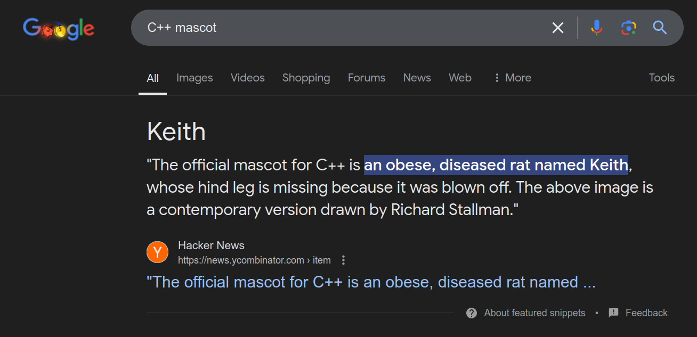
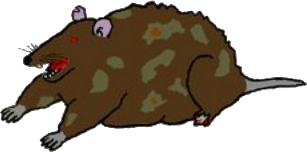

# Language Wars!

## Seriously, Come in Peace

The number 1 complaint about Rustaceans is that we tend to pop up and say
"should've written it in Rust", or "rewrite it in Rust!".

That's **not** how you make friends or influence people. C has been around since
1972, and C++ since 1985. Rust draws from many of their mistakes --- but it also
draws from many of their successes. By all means, rewrite things in Rust - but
please, please, please - let's keep it friendly!